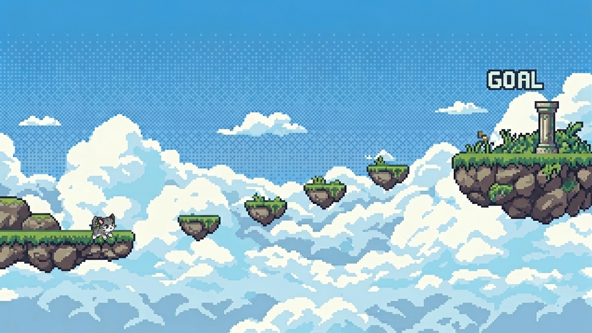

Parkour RPG

A 2D platformer built with Pygame where players navigate obstacles, talk to NPCs, and progress through multiple stages.

Play the Game:

Download the source code from this repository and run:
python main.py

Features:

Smooth platforming movement
NPC dialogue system
Multiple stages
Jump and parkour mechanics
Full-screen gameplay

Requirements:

Python 3.11+
Pygame

Install Pygame:

pip install pygame

Run
python main.py

Controls:

A / Left Arrow — Move Left
D / Right Arrow — Move Right
Space — Jump
ESC — Quit

How It Works:

The game is built using Pygame. The player can move through stages, interact with NPCs, and complete platforming challenges. Assets are loaded from local media folders and rendered in real time using Pygame's event and rendering systems.

Created for the Stardance Hackathon.

Built with:

Python
Pygame
